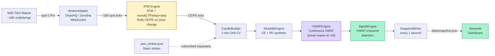
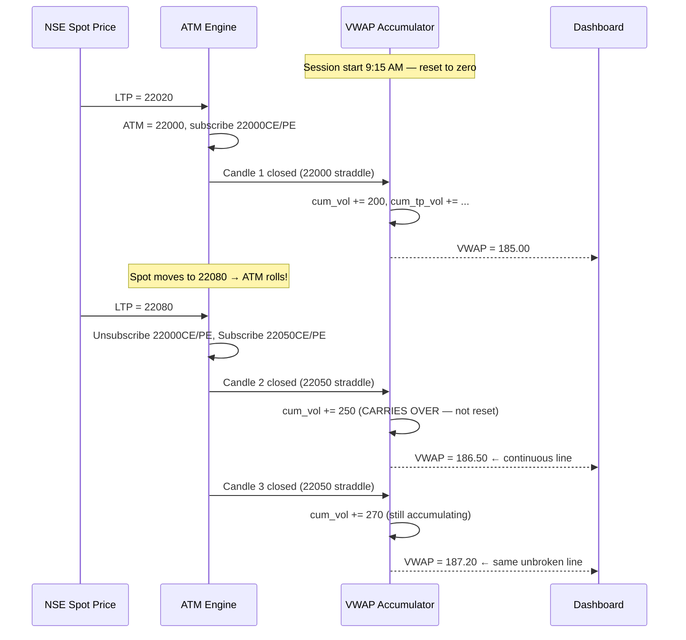

# Rolling ATM Straddle & VWAP Scanner

A real-time NSE F&O scanner that tracks the **At-The-Money straddle** for every underlying in the F&O universe (~180 symbols), computes a **continuous intraday VWAP**, and fires alerts on VWAP crossovers — all driven by a live WebSocket feed.

---

## What It Does

| Feature | Detail |
|---|---|
| **Data source** | Live WebSocket from DhanHQ or Zerodha Kite Connect |
| **Universe** | All ~180 NSE F&O underlyings |
| **ATM tracking** | Dynamic — rolls CE/PE subscriptions as spot price moves |
| **VWAP** | Continuous (never resets on roll; one line per underlying, all day) |
| **Signals** | VWAP crossover UP/DOWN on 1-min straddle candles |
| **User strikes** | Static user-defined strikes with custom BUY/SELL logic |
| **Dashboard** | Streamlit + Plotly — live candlestick + VWAP overlay |

---

## System Architecture

> **Interactive diagram:** [docs/architecture.excalidraw](docs/architecture.excalidraw) — open at [excalidraw.com](https://excalidraw.com)



**Every minute**, the pipeline closes 1-min candles, builds the synthetic straddle, updates VWAP, and scans for crossover signals. The snapshot is written every second so the dashboard always reflects the latest state.

---

## How It Works

### 1. WebSocket Data Ingestion

The scanner connects to the broker WebSocket at startup and subscribes to **spot/futures tokens** for all ~180 NSE F&O underlyings. The `BrokerAdapter` abstract interface means you can swap between DhanHQ and Zerodha by changing a single env variable:

```bash
BROKER=dhan   # or zerodha
```

Both adapters normalise tick volume to **delta (per-tick)** rather than cumulative daily volume.

---

### 2. Rolling ATM Engine

For each underlying, the ATM strike is computed from the live spot price every time a tick arrives:

```
ATM Strike = round(Spot LTP / strike_step) × strike_step
```

Example:
- NIFTY Spot = 22030, step = 50 → **ATM = 22000**
- NIFTY Spot = 22080, step = 50 → **ATM = 22050** ← roll fires

On a roll, the engine automatically **unsubscribes** the old CE/PE tokens and **subscribes** the new ones — no manual intervention needed. This keeps the active WebSocket subscription set lean (max ~360 option tokens at any time).

---

### 3. Continuous VWAP Across Strike Rolls

This is the key design decision in the scanner. When the ATM rolls, the VWAP accumulator is **never reset** — it carries over, producing one unbroken VWAP line per underlying for the entire session.

> **Interactive diagram:** [docs/vwap_rollover.excalidraw](docs/vwap_rollover.excalidraw) — open at [excalidraw.com](https://excalidraw.com)



**Formula:**
```
VWAP = Σ(TP × Volume) / Σ(Volume)
Typical Price (TP) = (High + Low + Close) / 3
```

The accumulators are stored in `StateStore` and reset only at 9:15 AM session start.

---

### 4. Signal Detection

The `SignalEngine` scans all active straddle series every minute for VWAP crossovers:

| Signal | Condition |
|---|---|
| `VWAP_CROSSOVER_UP` | `prev.close ≤ prev.vwap` AND `curr.close > curr.vwap` |
| `VWAP_CROSSOVER_DOWN` | `prev.close ≥ prev.vwap` AND `curr.close < curr.vwap` |

User-defined strikes (from `config/user_strikes.json`) are scanned separately with the same logic, tagged with their configured BUY/SELL action.

---

### 5. Live Dashboard

The Streamlit dashboard reads the JSON snapshot file and refreshes every 2 seconds:

- **Dropdown** to select any underlying from the live universe
- **Candlestick chart** of the synthetic straddle price (CE + PE)
- **VWAP overlay** as an orange dotted line
- **Signals panel** showing the latest crossover alerts

---

## Project Structure

```
trading_app_python/
├── src/scanner/
│   ├── main.py              # asyncio orchestration entry point
│   ├── config.py            # AppConfig + UserStrikesConfig
│   ├── instruments.py       # InstrumentRegistry (token lookups, strike step inference)
│   ├── state.py             # StateStore, Tick, CandleRow, VWAPAccumulator
│   ├── atm_engine.py        # Rolling ATM + subscription management
│   ├── candle_builder.py    # Tick → 1-min OHLCV aggregator
│   ├── straddle_engine.py   # CE + PE candle combiner
│   ├── vwap_engine.py       # Continuous VWAP calculator
│   ├── signal_engine.py     # VWAP crossover scanner
│   ├── snapshot.py          # Atomic JSON snapshot writer
│   └── brokers/
│       ├── base.py          # Abstract BrokerAdapter interface
│       ├── dhan.py          # DhanHQ implementation
│       └── zerodha.py       # Zerodha Kite Connect implementation
├── dashboard/
│   └── app.py               # Streamlit + Plotly dashboard
├── config/
│   ├── settings.yaml        # App settings
│   └── user_strikes.json    # User-defined static strikes
├── tests/                   # 65 unit + integration tests
├── docs/                    # Excalidraw architecture diagrams
└── pyproject.toml
```

---

## Installation

### Prerequisites

- Python 3.11+
- A broker account with API access:
  - [DhanHQ](https://dhanhq.co) — recommended (more liberal rate limits for F&O scanning)
  - [Zerodha Kite Connect](https://kite.trade) — also supported

### Setup

**1. Clone and create a virtual environment:**

```bash
git clone https://github.com/hkc-8010/trading-app-python.git
cd trading-app-python
python3 -m venv .venv
source .venv/bin/activate
```

**2. Install dependencies:**

```bash
pip install -e ".[dev]"
```

**3. Configure credentials:**

```bash
cp .env.example .env
```

Edit `.env` and fill in your broker credentials:

```env
BROKER=dhan                          # or zerodha

# DhanHQ credentials
DHAN_CLIENT_ID=your_client_id
DHAN_ACCESS_TOKEN=your_access_token

# Zerodha credentials (if using zerodha)
KITE_API_KEY=your_api_key
KITE_ACCESS_TOKEN=your_access_token
```

**4. (Optional) Adjust strike step overrides and scan settings:**

Edit `config/settings.yaml`:

```yaml
broker: dhan
market_open: "09:15"
scan_interval_seconds: 60
snapshot_interval_seconds: 1

strike_step_overrides:
  NIFTY: 50
  BANKNIFTY: 100
  FINNIFTY: 50
  MIDCPNIFTY: 25
```

**5. (Optional) Add user-defined static strikes:**

Edit `config/user_strikes.json`:

```json
{
  "strikes": [
    {
      "symbol": "NIFTY",
      "expiry": "2025-07-31",
      "strike": 22000,
      "option_type": "CE",
      "action": "BUY"
    }
  ]
}
```

---

## Usage

### Running the Scanner

Start the scanner **before market open** (9:15 AM IST):

```bash
python -m scanner.main
```

On startup it will:
1. Connect to the broker WebSocket
2. Download the master instrument list (~50k instruments)
3. Subscribe to ~180 NSE spot/futures tokens
4. Begin firing ATM subscriptions as ticks arrive
5. Start the 1-minute candle close loop
6. Write `data/snapshot.json` every second

### Running the Dashboard

In a **separate terminal**, after starting the scanner:

```bash
streamlit run dashboard/app.py
```

Open [http://localhost:8501](http://localhost:8501) in your browser.

### Running Tests

```bash
pytest tests/ -v --cov=src/scanner --cov-report=term-missing
```

Expected: **65 tests pass**, ≥90% coverage on core modules.

---

## Configuration Reference

| Variable | Source | Default | Description |
|---|---|---|---|
| `BROKER` | `.env` | `dhan` | `dhan` or `zerodha` |
| `DHAN_CLIENT_ID` | `.env` | — | DhanHQ client ID |
| `DHAN_ACCESS_TOKEN` | `.env` | — | DhanHQ access token |
| `KITE_API_KEY` | `.env` | — | Zerodha API key |
| `KITE_ACCESS_TOKEN` | `.env` | — | Zerodha access token |
| `broker` | `settings.yaml` | `dhan` | Active broker (overridden by `BROKER` env) |
| `market_open` | `settings.yaml` | `09:15` | Time to reset VWAP accumulators |
| `scan_interval_seconds` | `settings.yaml` | `60` | Candle close frequency |
| `snapshot_interval_seconds` | `settings.yaml` | `1` | Dashboard refresh rate |
| `strike_step_overrides` | `settings.yaml` | — | Override auto-inferred strike steps |

---

## Architecture Diagrams

The `docs/` folder contains editable Excalidraw diagrams:

| Diagram | Description | Open |
|---|---|---|
| [`architecture.excalidraw`](docs/architecture.excalidraw) | Full system architecture | [excalidraw.com](https://excalidraw.com) |
| [`vwap_rollover.excalidraw`](docs/vwap_rollover.excalidraw) | VWAP carry-over across ATM rolls | [excalidraw.com](https://excalidraw.com) |

To open: go to [excalidraw.com](https://excalidraw.com), click **Open** → select the `.excalidraw` file.

---

## Disclaimer

This tool is for **educational and research purposes only**. It is not financial advice. Always paper-trade and backtest before using any signal in live markets. Options trading involves significant risk of loss.
